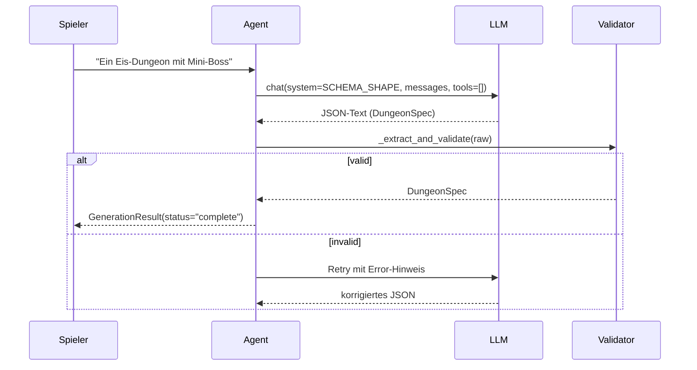

# LLM Agent

Claude-basierter Dungeon-Architekt der einen Spieler-Prompt in eine validierte `DungeonSpec` übersetzt. Aktuelle Implementation: **Structured JSON Output**, kein Tool-Use mehr.

## Modell & SDK

- **Modell:** `claude-sonnet-4-5-20250514` (Default, override via `LIVEGEN_MODEL`-env, `sidecar/src/livegen/llm.py:59,227`)
- **SDK:** `anthropic` Python-SDK (`>=0.52`, `sidecar/pyproject.toml:9`)
- **Methode:** Messages API mit reiner Text-Completion und `tools=[]` — der LLM antwortet mit purem JSON

## Flow

## System-Prompt

`SYSTEM_PROMPT` in `agent.py:35-44` definiert:

- Rolle: "You design Zelda OoT dungeons"
- Schema (über `SCHEMA_SHAPE` injiziert, `agent.py:16-33`) — Room-Templates, Enemies, Door-Types, Boss-Slot
- Constraint: 2–8 rooms, lowercase-mit-underscores Namen
- Output-Format: **nur JSON**, kein Markdown, kein Prosa

## Retry-Mechanik

`_generate()` (`agent.py:72-107`) erlaubt einen Retry:

1. Erster Versuch ohne Retry-Hinweis.
2. Wenn JSON-Parse oder Schema-Validierung fehlschlägt: User-Message mit konkretem Error hinzufügen und nochmal LLM aufrufen.
3. Beide Versuche fehlgeschlagen → `GenerationResult(status="error", error=...)`.

## Session-Management

Jede Generation wird in einer `Session`-Dataclass getrackt (`agent.py:47-53`):

- `session_id`: extern vergeben (vom HTTP-Layer)
- `messages`: Komplette Konversationshistory als `list[dict]`
- `finished`: Flag, ob Dungeon akzeptiert wurde
- `result`: Finaler `DungeonSpec` (wenn fertig)
- `stored_id`: optional, Referenz auf persistierten Run

## Backends

`create_backend()` (`llm.py`) wählt zwischen:

- **`AnthropicBackend`** (`llm.py:56-`) — Claude via Anthropic-API, Tool-Use vorhanden aber im Agent-Pfad nicht genutzt
- Lokales LLM-Backend für Tests/Offline-Betrieb

`AnthropicBackend.chat(...)` kann Tools entgegennehmen, der `DungeonAgent` übergibt jedoch konsistent `tools=[]` (`agent.py:81`).
