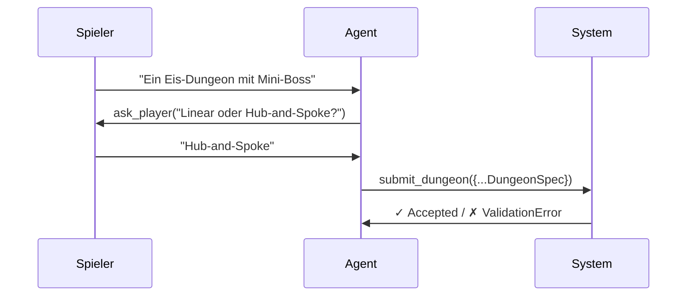

# LLM Agent

Claude-basierter Dungeon-Architekt der über Tool-Use mit dem Spieler kommuniziert.

## Modell & SDK

- **Modell:** claude-sonnet-4-5
- **SDK:** Anthropic Python SDK
- **Methode:** Messages API mit Tool-Use

## Tool-Use-Loop

## Tools

| Tool | Input | Max | Beschreibung |
|------|-------|-----|-------------|
| `ask_player` | question, options? | 3× | Rückfrage an Spieler |
| `submit_dungeon` | DungeonSpec | 1× | Finalen Dungeon einreichen |

## Constraints

- **Max 3 Rückfragen** — danach wird `ask_player` aus der Tool-Liste entfernt
- **Schema-Validierung bei Submit** — bei Fehler bekommt Agent einen Tool-Error mit Korrektur-Hinweis und darf erneut submitten
- **Kein Text-Only** — wenn Agent nur Text produziert ohne Tool-Call, wird er aufgefordert ein Tool zu nutzen

## Session-Management

Jede Generation wird in einer `Session` getrackt:
- `session_id`: UUID-basiert
- `messages`: Komplette Konversationshistory
- `questions_asked`: Zähler für Rückfragen
- `finished`: Flag ob Dungeon akzeptiert wurde
- `result`: Finaler DungeonSpec (wenn fertig)

## System-Prompt

Der Agent bekommt:
- Rolle als "Dungeon Architect for OoT"
- Liste verfügbarer Room-Templates
- Regeln für Key-Logik und Boss-Platzierung
- Dynamisches Update der verbleibenden Fragen-Anzahl
