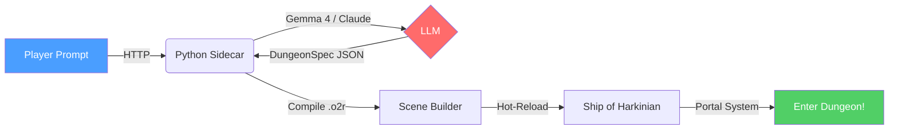
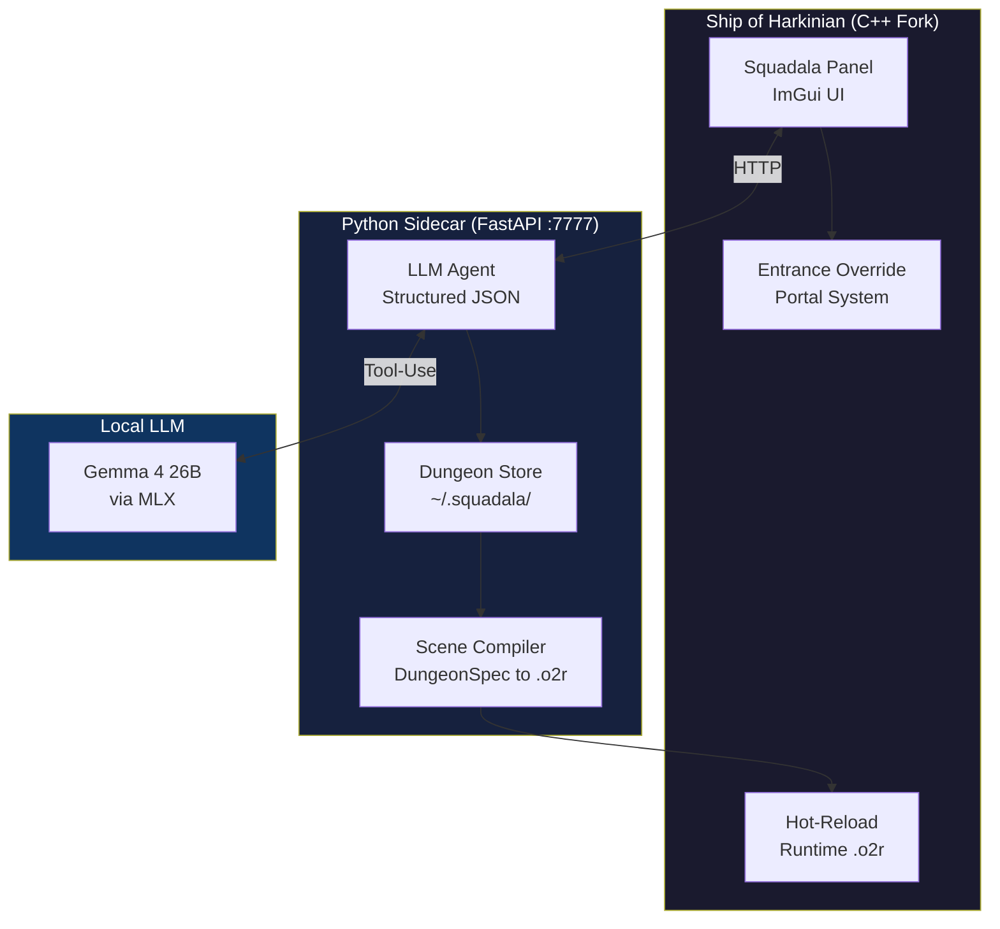

# Squadala — AI Dungeon Generator for Ship of Harkinian

> *"Squadala! We're off!"* — Generate Zelda dungeons with a local LLM, directly from within the game.

Describe a dungeon, the AI designs it, walk through any door to enter. Custom 3D geometry rendered in real-time via Hot-Reload.

## How It Works



## Architecture



## Repository Structure

```
squadala/
├── sidecar/         Python FastAPI + LLM Agent (Anthropic / MLX / Ollama)
├── tooling/         Scene & DL compilers (build_box_room.py + 64 Pytest tests)
├── docs/            Project specs
├── .wiki/           Technical deep-dives (DL format, OTR resolution, etc.)
├── release_notes/   Versioned release notes (v0.1 → v0.4)
└── soh-source/      Git submodule → Marvbuster/Shipwright-Squadala (C++ fork)
```

## Features

| Feature | Status | Description |
|---------|--------|-------------|
| LLM Dungeon Generation | Done | Structured JSON output, 100% success rate with Gemma 4 |
| In-Game UI | Done | Squadala panel with Generate + My Dungeons tabs |
| Portal System | Done | Entrance override redirects any door |
| Hot-Reload | Done | No restart needed |
| Dungeon Persistence | Done | Saved in `~/.squadala/dungeons/` |
| Dungeon Notification | Done | Shows dungeon name on entry |
| Actor Injection | Done | Custom enemies and chests |
| **Custom 3D Geometry** | **Done (v0.4)** | Custom Display Lists render in SoH! |
| LLM-Generated Meshes | Planned | MeshLLM / procedural rooms |

## Quick Start

```bash
# 1. Clone with submodule
git clone --recurse-submodules https://github.com/Marvbuster/squadala.git
cd squadala

# 2. Build the fork
cd soh-source
# Follow soh-source/docs/BUILDING.md

# 3. Start the Python sidecar
cd sidecar
uv sync
uv run uvicorn livegen.api:app --port 7777

# 4. Start a local LLM (in another terminal)
mlx_lm.server --model mlx-community/gemma-4-26b-a4b-it-4bit --port 11434

# 5. Launch the game
./soh-source/build-cmake/soh/soh-macos
# ESC → Enhancements → Squadala → describe a dungeon → Enter!
```

## Tech Stack

- **Sidecar:** Python 3.12, FastAPI, Anthropic SDK, Pydantic, NetworkX
- **SoH Fork:** C/C++, ImGui, libcurl, nlohmann/json
- **LLM:** Gemma 4 26B (local via MLX) or Claude Sonnet (Anthropic API)
- **Tooling:** uv, ruff, mypy, pytest

## Documentation

- [Project Overview](docs/oot-live-dungeon-spec.md) — Complete project specification
- [Wiki Index](.wiki/INDEX.md) — Technical articles (architecture, formats, milestones)
- [Custom Geometry Pipeline](.wiki/articles/architecture/custom-geometry-pipeline.md) — How custom 3D rendering works
- [OTR DL Resolution](.wiki/articles/architecture/otr-dl-resolution.md) — How `__OTR__` paths are resolved
- [Release Notes](release_notes/README.md) — Per-version changelogs

## Milestones

| # | Name | Status |
|---|------|--------|
| M1 | Sidecar Standalone | Done |
| M2 | Template Extraction (218 rooms) | Done |
| M3 | .o2r Round-Trip | Done |
| M4 | In-Game UI | Done |
| M5 | Hot-Swap | Done |
| M5+ | **Custom 3D Geometry** | **Done (v0.4)** |
| M6 | Polish | Planned |

## Acknowledgments

This project stands on the shoulders of giants:

- **[Ship of Harkinian](https://github.com/HarbourMasters/Shipwright)** by HarbourMasters — the OoT PC port that makes everything possible
- **The SoH Randomizer Team** — the entrance override system is the foundation of Squadala's portal mechanism
- **[OoT Decompilation](https://github.com/zeldaret/oot)** by zeldaret — actor IDs, object mappings, scene formats
- **[OoT Randomizer](https://github.com/OoTRandomizer/OoT-Randomizer)** — dungeon logic and connectivity data
- **[libultraship](https://github.com/Kenix3/libultraship/)** — the runtime framework powering mod loading and resource management
- **[Fast64](https://github.com/HarbourMasters/fast64)** — Blender tools for OoT scene creation
